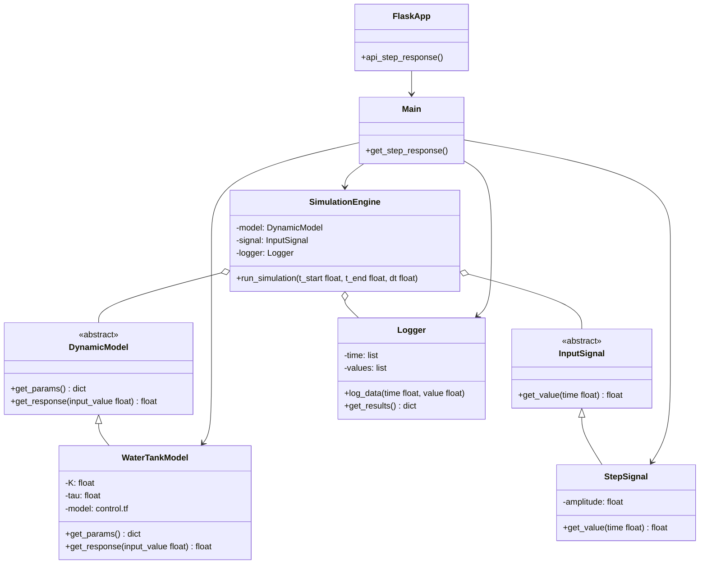

# Source Code OOP Architecture

This document describes the OOP architecture of the `src` directory, which contains the backend Flask application and the simulation engine.

## Mermaid Class Diagram

## Architecture Overview

The backend application is divided into two main parts: the **Flask API** and the **Simulation Engine**.

### Flask API (`app.py`, `main.py`)

*   `app.py`: This is the main entry point for the Flask web server. It defines the `/api/step_response` endpoint.
*   `main.py`: This file contains the `get_step_response` function, which is responsible for setting up and running the simulation. It acts as a bridge between the API and the simulation engine.

### Simulation Engine (`/simulation` directory)

The simulation engine is designed using a modular, object-oriented approach.

*   **`SimulationEngine`**: This is the core class that orchestrates the simulation. It takes a model, a signal, and a logger as inputs and runs the simulation over a given time period.
*   **`DynamicModel`**: This is an abstract base class that defines the interface for all dynamic models.
    *   **`WaterTankModel`**: A concrete implementation of a first-order water tank model.
*   **`InputSignal`**: This is an abstract base class that defines the interface for all input signals.
    *   **`StepSignal`**: A concrete implementation of a step signal.
*   **`Logger`**: A simple class for logging the simulation results (time and output values).

This architecture allows for easy extension. For example, you could add new models by creating new classes that inherit from `DynamicModel`, or new signal types by inheriting from `InputSignal`, without having to change the `SimulationEngine`.
